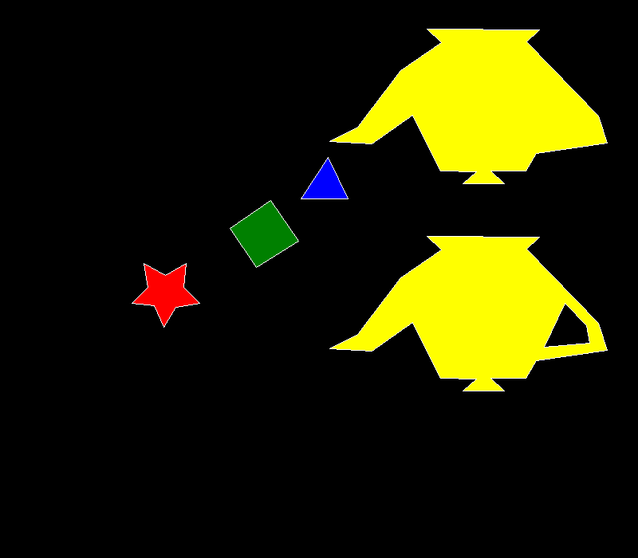

# Lab 1 - Relleno de Polígonos

Relleno de polígonos mediante scanline con regla par-impar, con bordes dibujados usando el algoritmo de Bresenham. El polígono 4 se dibuja dos veces: sólido y luego con el polígono 5 como agujero interno.

